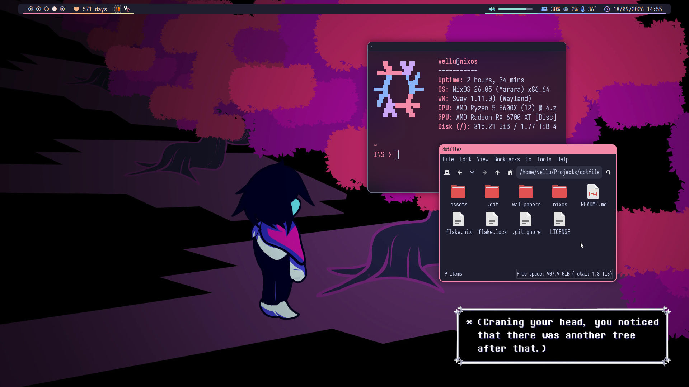

# velllu's NixOS config
  
This is my personal NixOS configuration, it is not meant to be used by anyone, as it's very opinionated.  
It used to be running BSPWM with polybar, since then, I have recreated that exact workflow with modern equivalents, like swayfx + autotiling for the tiling and a custom quickshell bar inspired by my old polybar config.

## Features
- Custom quickshell
- Styling with stylix
- Packages organized in bundles
- Templates for Python, Rust and JavaScript
- Configurable accent color
- Configured fish shell and terminal
- Screenshotting with `wayfreeze`, `slurp`, `grim` and `wl-copy`
